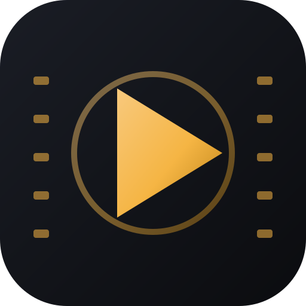

# CineTrack

A beautiful, dark-themed desktop app for tracking the movies and TV series you watch.
Built with Electron + React + TypeScript, with an optional live connection to
[TMDB](https://www.themoviedb.org/) that unlocks the full catalog of ~1M titles.



## Features

- **Live catalog** — search the world's movies & series (TMDB), with cast, crew,
  taglines, and "more like this" recommendations. Works fully offline too.
- **Library tracking** — status (watching / planned / completed / rewatching /
  dropped), personal 1–10 star ratings, notes, and watch dates.
- **Episode progress** — log individual episodes for series and keep a history.
- **Watchlist** — a separate queue of things you plan to get to.
- **Statistics dashboard** — watch time, genres, decades, rating distribution,
  and yearly activity, with charts.
- **IMDb import** — bring your existing IMDb ratings export (CSV) with one click.
- **Cinematic UI** — dark gold-on-charcoal theme, glassmorphic overlays, 3D
  pointer-tracking poster tilt, and animated transitions throughout.
- **Keyboard-first** — `Ctrl+K` search palette, `1–4` to switch views,
  `,` for settings, `Esc` to close panels.
- **Local & private** — your library lives in a single SQLite file on your
  machine. Nothing is uploaded.

## Getting started

### Prerequisites

- [Node.js](https://nodejs.org/) 18+ and npm
- Windows (Linux/macOS also work with minor packaging changes)

### Install & run in development

```bash
git clone https://github.com/<you>/cinetrack.git
cd cinetrack
npm install
npm run dev
```

### Build the Windows installer

```bash
npm run package
```

This produces `release/CineTrack-Setup-1.0.0.exe` — a standard NSIS installer
you can double-click to install and run like any other Windows app, with Start
Menu and desktop shortcuts. No Node.js, npm, or terminal needed on the target
machine.

To build an unpacked folder instead (faster, for quick testing):

```bash
npm run package:dir
```

## Connecting TMDB (optional but recommended)

CineTrack ships with a working offline experience, but connecting a free TMDB
account unlocks the full live catalog, posters, cast, and trending.

1. Create a free account at [themoviedb.org](https://www.themoviedb.org/)
2. Open **Settings → API** and request an API key
3. In CineTrack, open **Settings** (top-right gear, or press `,`) and paste your
   **read access token** (recommended) or the legacy v3 API key

Your key is stored locally in the app's data folder and never leaves your
machine. Posters are streamed on demand from TMDB's CDN, so they cost no local
storage.

## Project structure

```
cinetrack/
├── src/
│   ├── main/          # Electron main process
│   │   ├── db/        # SQLite schema, queries, FTS search index
│   │   ├── ipc/       # IPC handlers + IMDb CSV import
│   │   ├── tmdb/      # TMDB API client
│   │   └── seed-credentials.ts
│   ├── preload/       # contextBridge API surface
│   └── renderer/      # React UI
│       └── src/
│           ├── components/  # TopBar, CommandPalette, DetailPanel, PosterCard…
│           ├── views/       # Home, Library, Watchlist, Stats
│           ├── store/       # Zustand state
│           └── lib/         # api bridge, useTilt hook
├── drizzle/           # SQLite migrations
├── resources/         # App icons
└── electron-builder.yml
```

## Useful scripts

| Script | Purpose |
| --- | --- |
| `npm run dev` | Launch the app with hot reload |
| `npm run build` | Type-check + bundle for production |
| `npm run package` | Build the Windows `.exe` installer |
| `npm run typecheck` | Run TypeScript checks (node + web) |
| `npm run lint` | ESLint |
| `npm run format` | Prettier |
| `npm run test` | Vitest unit tests |

## Tech stack

- **Electron** — cross-platform desktop shell
- **React 19 + TypeScript** — UI
- **Tailwind CSS v4** — styling, with a custom dark theme token system
- **Framer Motion** — animations and transitions
- **Zustand** — state management
- **better-sqlite3 + Drizzle ORM** — local database with full-text search
- **electron-vite** — build tooling
- **electron-builder** — packaging & auto-update

## Privacy & data

Your library is stored in a single SQLite file inside the app's user-data
directory (`%APPDATA%/CineTrack/data/` on Windows). Use **Settings → Open data
folder** to back it up or move it to another machine. No analytics, no
telemetry, no account.

## Attribution

Movie & TV data and poster artwork provided by [TMDB](https://www.themoviedb.org/).
This product uses the TMDB API but is not endorsed or certified by TMDB.

## License

MIT
